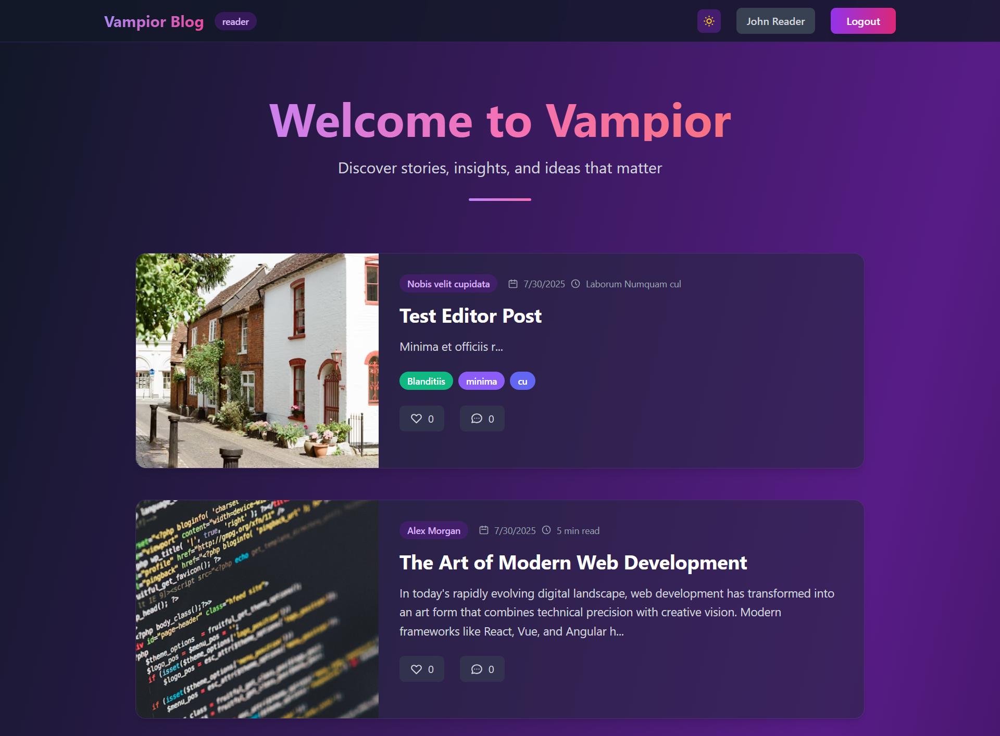

# 🧛 Vampior Blog

<p align="center">
  
</p>

<p align="center">
  <strong>A modern, feature-rich blog platform built with Laravel</strong>
</p>

<p align="center">
  <a href="#features">Features</a> •
  <a href="#tech-stack">Tech Stack</a> •
  <a href="#installation">Installation</a> •
  <a href="#usage">Usage</a> •
  <a href="#contributing">Contributing</a>
</p>

---

## 📝 About Vampior Blog

Vampior Blog is a comprehensive blogging platform that combines the power of Laravel with modern web technologies to deliver an exceptional reading and writing experience. Built with a focus on user experience, performance, and accessibility, it features a multi-role system supporting admins, editors, and readers.

## ✨ Features

### 🎯 Core Features
- **Multi-Role Authentication System** - Admin, Editor, and Reader roles with appropriate permissions
- **Interactive Dashboard** - Role-based dashboards with tailored functionality
- **Rich Blog Management** - Create, edit, publish, and manage blog posts with ease
- **Tag System** - Organize posts with colorful, customizable tags
- **Comments System** - Engage readers with threaded comments
- **Like Functionality** - Allow readers to express appreciation for posts
- **Single Post Pages** - Dedicated pages for individual blog posts with full functionality

### 🎨 User Experience
- **Dark/Light Mode** - Seamless theme switching with persistent preferences
- **Responsive Design** - Perfect experience across all devices and screen sizes
- **Modern UI/UX** - Clean, minimalist design with smooth animations
- **Accessibility First** - WCAG compliant with keyboard navigation support
- **Performance Optimized** - Fast loading times and efficient database queries

### 🔧 Technical Features
- **RESTful API** - Clean API endpoints for all major functionalities
- **Database Relationships** - Efficient Eloquent relationships and queries
- **Migration System** - Version-controlled database schema management
- **Seeder Support** - Sample data for development and testing
- **CSRF Protection** - Secure forms and API endpoints
- **Session Management** - Persistent login states and preferences

## 🛠 Tech Stack

### Backend
- **[Laravel 10.x](https://laravel.com/)** - PHP Web Application Framework
- **[PHP 8.1+](https://php.net/)** - Server-side scripting language
- **[MySQL](https://mysql.com/)** - Relational database management system
- **[Eloquent ORM](https://laravel.com/docs/eloquent)** - Database abstraction layer

### Frontend
- **[Blade Templates](https://laravel.com/docs/blade)** - Laravel's templating engine
- **[Tailwind CSS](https://tailwindcss.com/)** - Utility-first CSS framework
- **[Vite](https://vitejs.dev/)** - Modern build tool and development server
- **Vanilla JavaScript** - For interactive functionality
- **PostCSS** - CSS post-processing

### Development Tools
- **[Composer](https://getcomposer.org/)** - PHP dependency manager
- **[NPM](https://npmjs.com/)** - Node.js package manager
- **[Laravel Breeze](https://laravel.com/docs/starter-kits#laravel-breeze)** - Authentication scaffolding

## 📋 Prerequisites

Before you begin, ensure you have the following installed:

- **PHP 8.1 or higher** with the following extensions:
  - BCMath PHP Extension
  - Ctype PHP Extension
  - cURL PHP Extension
  - DOM PHP Extension
  - Fileinfo PHP Extension
  - JSON PHP Extension
  - Mbstring PHP Extension
  - OpenSSL PHP Extension
  - PCRE PHP Extension
  - PDO PHP Extension
  - Tokenizer PHP Extension
  - XML PHP Extension
- **Composer** (latest version)
- **Node.js** (v16 or higher) and **NPM**
- **MySQL** (v8.0 or higher) or **MariaDB**
- **Git** for version control

## 🚀 Installation

### 1. Clone the Repository

```bash
git clone https://github.com/Nimesh-Kavinda/Vampior_Blog.git
cd Vampior_Blog
```

### 2. Install PHP Dependencies

```bash
composer install
```

### 3. Install Node.js Dependencies

```bash
npm install
```

### 4. Environment Configuration

```bash
# Copy the environment file
cp .env.example .env

# Generate application key
php artisan key:generate
```

### 5. Database Setup

1. Create a MySQL database for the project
2. Update your `.env` file with database credentials:

```env
DB_CONNECTION=mysql
DB_HOST=127.0.0.1
DB_PORT=3306
DB_DATABASE=vampior_blog
DB_USERNAME=your_username
DB_PASSWORD=your_password
```

### 6. Run Database Migrations

```bash
# Run migrations to create tables
php artisan migrate

# Seed the database with sample data
php artisan db:seed
```

### 7. Build Assets

```bash
# For development
npm run dev

# For production
npm run build
```

### 8. Start the Development Server

```bash
php artisan serve
```

The application will be available at `http://localhost:8000`

## 🎮 Usage

### Default User Accounts

After seeding, you can use these default accounts:

**Admin Account:**
- Email: `admin@vampior.com`
- Password: `password`

**Editor Account:**
- Email: `editor@vampior.com`
- Password: `password`

**Reader Account:**
- Email: `reader@vampior.com`
- Password: `password`

### Role Permissions

| Feature | Admin | Editor | Reader |
|---------|-------|--------|--------|
| Create Posts | ✅ | ✅ | ❌ |
| Edit Own Posts | ✅ | ✅ | ❌ |
| Edit All Posts | ✅ | ❌ | ❌ |
| Delete Posts | ✅ | ❌ | ❌ |
| Manage Users | ✅ | ❌ | ❌ |
| Like Posts | ✅ | ✅ | ✅ |
| Comment on Posts | ✅ | ✅ | ✅ |
| View Published Posts | ✅ | ✅ | ✅ |

### Navigation

- **Welcome Page** (`/`) - Public landing page with recent posts
- **Dashboard** (`/dashboard`) - Reader dashboard with interactive posts
- **Admin Dashboard** (`/admin/dashboard`) - Admin management interface
- **Editor Dashboard** (`/editor/dashboard`) - Editor content management
- **Single Post** (`/singlepost/{id}`) - Individual post pages with full functionality

## 🔧 Development

### Running in Development Mode

```bash
# Start Laravel development server
php artisan serve

# In a separate terminal, start Vite dev server for hot reloading
npm run dev
```

### Database Management

```bash
# Create a new migration
php artisan make:migration create_table_name

# Create a new model with migration
php artisan make:model ModelName -m

# Create a new seeder
php artisan make:seeder SeederName

# Refresh database with fresh data
php artisan migrate:refresh --seed
```

### Cache Management

```bash
# Clear application cache
php artisan cache:clear

# Clear configuration cache
php artisan config:clear

# Clear route cache
php artisan route:clear

# Clear view cache
php artisan view:clear
```

## 📁 Project Structure

```
vampior-blog/
├── app/
│   ├── Http/Controllers/     # Application controllers
│   ├── Models/              # Eloquent models
│   └── ...
├── database/
│   ├── migrations/          # Database migrations
│   ├── seeders/            # Database seeders
│   └── factories/          # Model factories
├── public/                 # Public assets
├── resources/
│   ├── css/               # Stylesheets
│   ├── js/                # JavaScript files
│   └── views/             # Blade templates
├── routes/
│   ├── web.php            # Web routes
│   └── api.php            # API routes
├── storage/               # File storage
├── tests/                 # Test files
├── .env.example          # Environment template
├── composer.json         # PHP dependencies
├── package.json          # Node.js dependencies
├── tailwind.config.js    # Tailwind configuration
└── vite.config.js        # Vite configuration
```

## 🤝 Contributing

We welcome contributions to Vampior Blog! Please follow these steps:

1. Fork the repository
2. Create a feature branch (`git checkout -b feature/amazing-feature`)
3. Commit your changes (`git commit -m 'Add some amazing feature'`)
4. Push to the branch (`git push origin feature/amazing-feature`)
5. Open a Pull Request

### Development Guidelines

- Follow PSR-12 coding standards for PHP
- Use meaningful commit messages
- Write tests for new features
- Update documentation as needed
- Ensure all tests pass before submitting

## 📝 License

This project is open-sourced software licensed under the [MIT license](https://opensource.org/licenses/MIT).

## 👨‍💻 Author

**Nimesh Kavinda**
- GitHub: [@Nimesh-Kavinda](https://github.com/Nimesh-Kavinda)
- Project: [Vampior_Blog](https://github.com/Nimesh-Kavinda/Vampior_Blog)

## 🙏 Acknowledgments

- [Laravel](https://laravel.com/) for the amazing framework
- [Tailwind CSS](https://tailwindcss.com/) for the utility-first CSS framework
- [Unsplash](https://unsplash.com/) for the beautiful stock images
- The open-source community for inspiration and resources

---

<p align="center">Made with ❤️ by <a href="https://github.com/Nimesh-Kavinda">Nimesh Kavinda</a></p>
